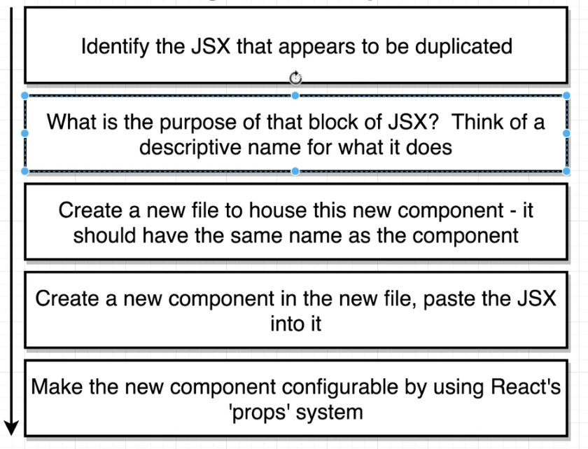
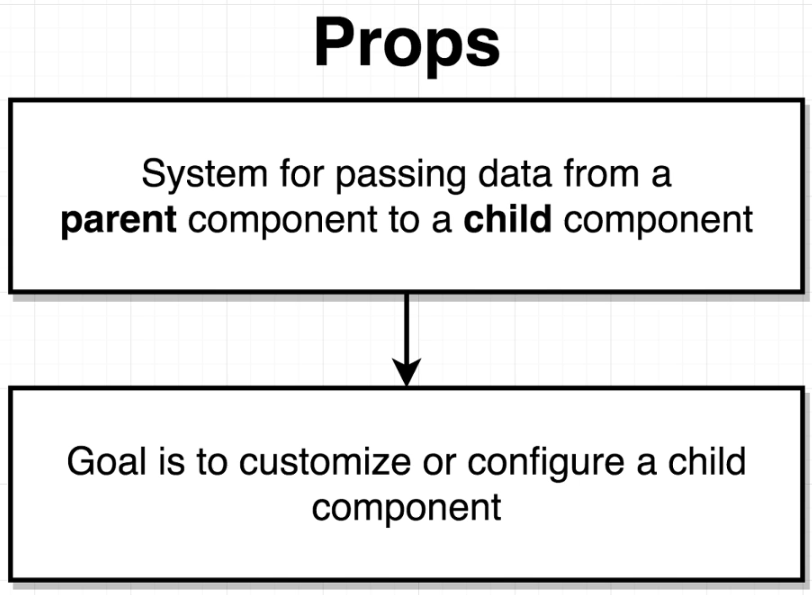

# Components and Props

## Three Tenets of Components


## Creating a Resuable, Configurable Component


## Props


## Application

Semantic UI CDN Link: ```<link rel="stylesheet"  href="https://cdnjs.cloudflare.com/ajax/libs/semantic-ui/2.4.1/semantic.min.css" />```

Using faker.js for avatars and names
```npm install --save faker```

Components:
* ```CommentDetail.js```
