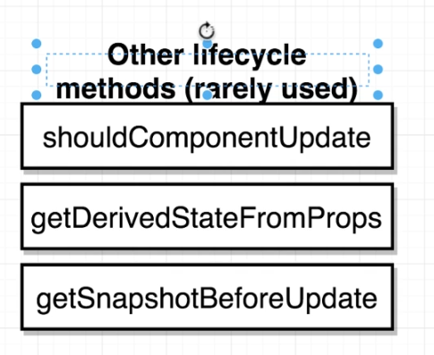
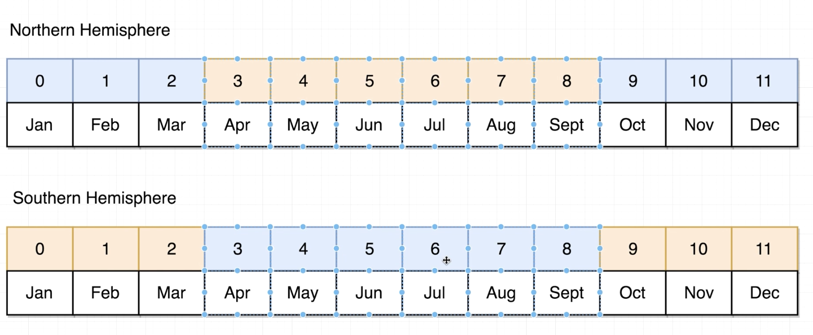

# Class Based Components

## Benefits of using class based components

## State
State is use for updating the content of class based component

## Components

## Application

### Logic:

Orange box is Summer
Blue box is Winter

