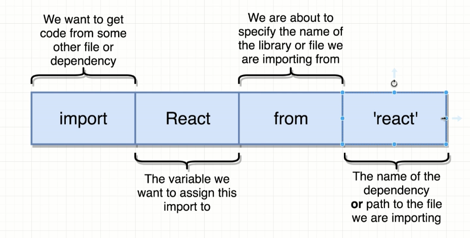
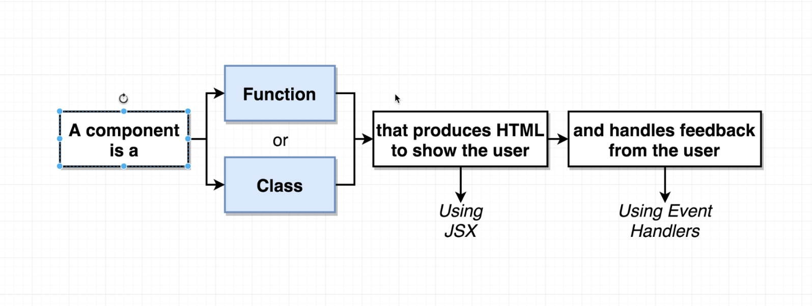

# React
Repo to quickly recap React concepts

## React import description

## React Component

## Application

Semantic UI CDN Link: <link rel="stylesheet"  href="https://cdnjs.cloudflare.com/ajax/libs/semantic-ui/2.4.1/semantic.min.css" />